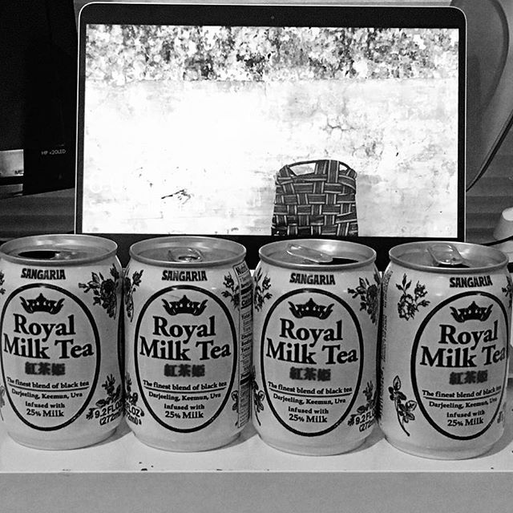

# This is Jeff's awesome website

What if I add some text here is this gonna work


## here is a subsection 

and here is some additonal text 

```{r}
rnorm(10)

```
# Links to other websites 

Let's link to useful toold for data science 

* [Google](https://www.google.com/)
* [P8105](https://p8105.com/index.html)

# Local Image 

Milk tea!

## Link to page within the site 

[About me](about.html)

